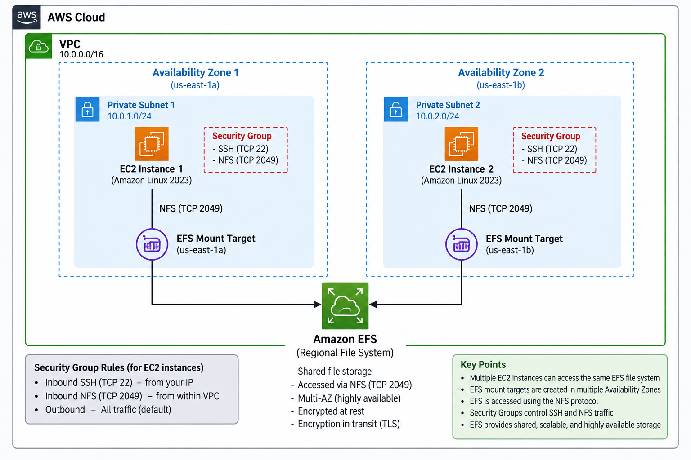
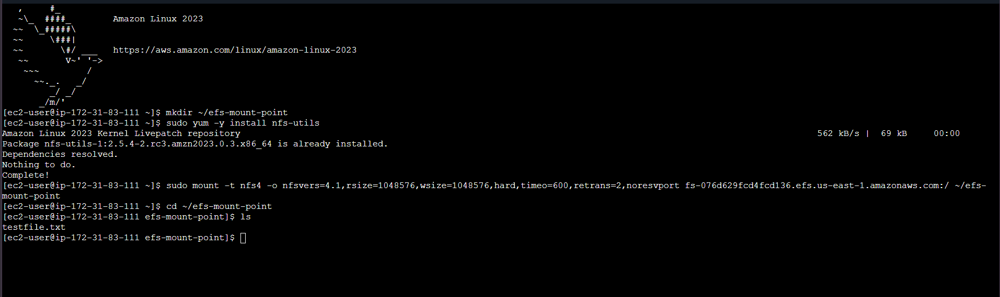
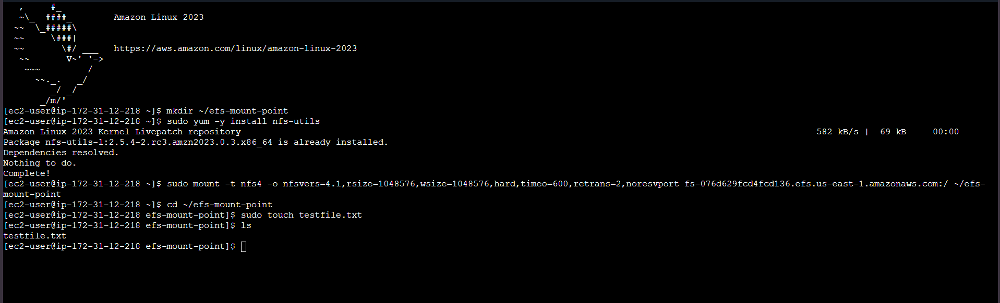

# Amazon EFS Multi-AZ Shared File System

## Overview

In this project, I built and tested a shared file system using Amazon EFS and Amazon EC2 instances across multiple Availability Zones.

The objective was to understand how Amazon EFS provides shared file storage that can be accessed by multiple EC2 instances using the NFS protocol.

## Architecture

The architecture consists of:

- Amazon EC2 instances running Amazon Linux 2023
- Amazon EFS file system
- EFS mount targets in multiple Availability Zones
- Security Groups controlling SSH and NFS traffic
- NFS protocol for communication between EC2 and EFS

## AWS Services Used

- Amazon EC2
- Amazon EFS
- Amazon VPC
- Security Groups

## What I Built

1. Created a security group for the EC2 instances.
2. Allowed SSH access to the instances.
3. Allowed NFS traffic on TCP port 2049.
4. Created an Amazon EFS file system.
5. Configured EFS mount targets for the Availability Zones.
6. Created an EFS mount point on the EC2 instances.
7. Installed the NFS client.
8. Mounted the EFS file system using NFS.
9. Created a test file on the EFS file system.
10. Installed `amazon-efs-utils`.
11. Mounted EFS using the EFS mount helper with TLS encryption in transit.

## Mounting EFS

The EFS file system was mounted to:

    ~/efs-mount-point

## Verification

After mounting the EFS file system, I created a test file:

    sudo touch testfile.txt

I then verified that the file was present on the mounted file system:

    ls

The output showed:

    testfile.txt

### EC2 Instance 1

The EFS file system was successfully mounted using NFS, and `testfile.txt` was created and verified.

### EC2 Instance 2

The EFS file system was also successfully mounted from the second EC2 instance.

## Troubleshooting

During the lab, I enabled encryption at rest for the EFS file system and then added a file system policy requiring encryption in transit.

Before enabling the encryption-in-transit requirement, I was able to mount EFS using the standard NFS client and create `testfile.txt`.

After enabling the policy, I unmounted the file system and attempted to mount it again using the standard NFS mount command.

The mount was no longer successful because the connection was not using TLS.

I then installed `amazon-efs-utils`:

    sudo yum install -y amazon-efs-utils

I mounted EFS again using the EFS mount helper with TLS:

    sudo mount -t efs -o tls <EFS-DNS-NAME>:/ ~/efs-mount-point

After mounting with TLS, I was able to access the EFS file system again and `testfile.txt` was visible.

This helped me understand the difference between encryption at rest and encryption in transit, as well as why the EFS client must use TLS when the file system policy requires encryption in transit.

## What I Learned

### EFS uses NFS

Amazon EFS can be accessed from Linux EC2 instances using the NFS protocol.

### A mount point is just a directory

Creating:

    mkdir ~/efs-mount-point

does not connect the directory to EFS.

The EFS file system must be mounted to the directory before its files can be accessed.

### EFS can be accessed like a normal filesystem

Once mounted, standard Linux commands such as `ls`, `cd`, and `touch` can be used to work with files stored on EFS.

### EFS Utils

I also installed `amazon-efs-utils` and mounted EFS using the EFS mount helper with TLS encryption in transit:

    sudo yum install -y amazon-efs-utils

    sudo mount -t efs -o tls <EFS-DNS-NAME>:/ ~/efs-mount-point

## Key Takeaways

- Amazon EFS provides shared file storage for Linux workloads.
- EFS uses the NFS protocol.
- Multiple EC2 instances can access the same EFS file system.
- A mount point is the directory through which EFS is accessed.
- EFS must be mounted before its files can be accessed.
- `amazon-efs-utils` can be used to mount EFS with TLS encryption in transit.
